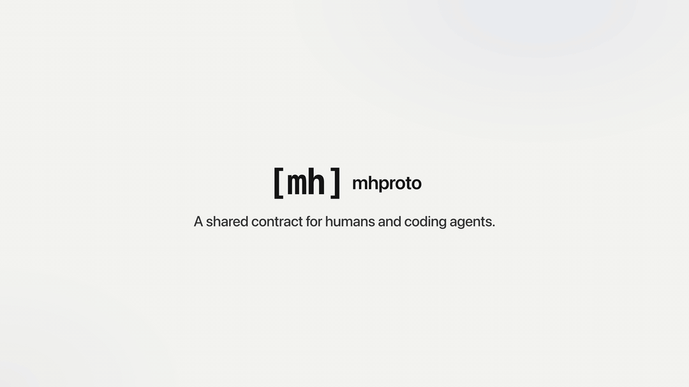

<div align="center">

# MHProto

**Describe a feature's behaviour, API and checks in your repo.<br>Review it in a browser. Give your coding agent exactly the part it needs.**

For developers using Claude Code, Codex and other coding agents on existing projects.

[](https://www.npmjs.com/package/mhproto)
[](https://github.com/rbsx/mhproto/actions/workflows/check.yml)
[](LICENSE)

[**Live demo**](https://mhproto.dev/demo/) · [How it works](doc/how-it-works.md) · [Docs](https://mhproto.dev/docs/)

<a href="https://mhproto.dev/#walkthrough"></a>

</div>

## What you get

- **Describe:** numbered rules, your OpenAPI 3.1, examples and checks as plain files, linked by rule ID.
- **Review:** linked pages for every feature, endpoint and type, plus what changed since the last snapshot.
- **Hand off:** your agent gets one endpoint's exact rules, types, errors and check status.
- **Verify:** run the linked tests and see which checks pass, fail or are stale, and which rules have none.

Local files and a CLI: no hosted service, no account and no AI calls.

## Quick start

```sh
npm install -D mhproto@next        # Node 22+
npx mhproto init --agent claude    # or --agent codex, or --agent all
npx mhproto view                   # serves http://127.0.0.1:4317
```

Replace the generated example with one real feature, or ask your agent to _"use mhproto-discover
to draft a contract for one feature"_.

**Next:** [How it works](doc/how-it-works.md) follows one feature end to end, with real files and
output. The [reference guide](https://mhproto.dev/docs/reference/) covers every command.

---

`0.8.0-preview.0` · development preview · [Feedback](https://github.com/rbsx/mhproto/issues) ·
[Contributing](CONTRIBUTING.md) · [MIT](LICENSE) ([third-party notices](THIRD_PARTY_NOTICES.md))
