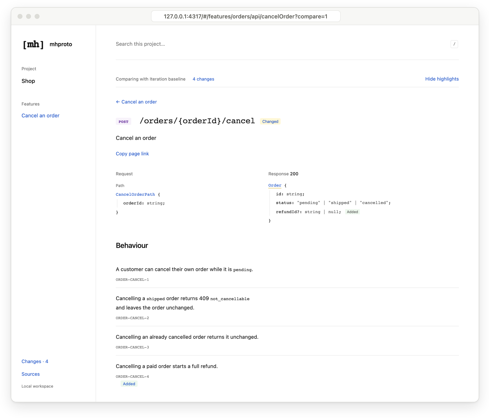

# How it works

MHProto (Machine–Human Protocol) puts the contract first. A feature's **behaviour rules, API,
examples and verification checks** live as plain files in your repository, and `npx mhproto view`
turns them into linked pages your team reviews before agents build and keeps in view while the
code changes. Your coding agent works from the same contract: it fetches a compact packet with
the exact rules for the endpoint it is changing. `npx mhproto verify` runs the linked checks and records
evidence tied to the current files, so later edits show up as stale and rules without a check
show up as gaps.

No hosted service, no account and no AI calls: it's a CLI over files you already review in pull requests.

To install, follow the [quick start](../README.md#quick-start). Command options and file details
are in the [reference guide](guide.md) and the
[file format](../skills/mhproto-format/SKILL.md).

## Who it's for

MHProto is built for **teams building with coding agents on existing projects**, especially
full-stack features where frontend and backend share an API. It fits features exposed as HTTP
endpoints and described in OpenAPI 3.1, and [plugins](plugins.md) add other sources.

Coding is no longer the bottleneck. Understanding what's being built is.

- **Agents write code faster than teams can follow it.** Plans, API shapes and edge cases get
  decided inside prompts and diffs, where product, design, frontend and backend rarely see them.
- **Late changes are expensive.** A mismatch between what the frontend expects and what the
  backend returns is cheap to fix in a contract, and costly once both sides are built.
- **Nobody can see which rules still hold.** After a few agent PRs, it's unclear which rules have
  a passing test, which results are out of date and which were never tested.

MHProto keeps the contract where everyone can see it, in a form both people and agents can use:

|                      | People                                   | Coding agents                              |
| -------------------- | ---------------------------------------- | ------------------------------------------ |
| Read the contract    | Linked pages in a browser                | Scoped JSON from `mhproto context`         |
| Change the contract  | Markdown, YAML and OpenAPI in a PR       | The same files, through the bundled skills |
| See what changed     | **Changes** view against a snapshot      | `mhproto diff`                             |
| Know what's verified | **Checks** on every feature and endpoint | Check status in endpoint packets           |

## One feature, end to end

This walkthrough follows one small feature: cancelling an order. The snippets are excerpts
from a working project, and the outputs are real.

### 1. Describe the feature in your repo

Each feature (a _capability_ in the files and CLI) has up to four parts: numbered behaviour rules,
an OpenAPI interface, examples and checks. Only the rules are required; add the other parts when
you need them. The interface is one OpenAPI 3.1 file with local `$ref`s (3.0 isn't supported),
and every operation in that file belongs to the feature.

```text
mhproto.yaml                       # lists your features and their files
mhproto/
  capabilities/orders/
    spec.md                        # Behaviour: numbered rules
    examples.yaml                  # Examples: given / when / then
    checks.yaml                    # Verification: rules → real tests
  interfaces/openapi.yaml          # Interface: your OpenAPI 3.1
```

Rules are Markdown bullets with stable IDs:

```md
- **ORDER-CANCEL-1** A customer can cancel their own order while it is `pending`.
- **ORDER-CANCEL-2** Cancelling a `shipped` order returns 409 `not_cancellable`
  and leaves the order unchanged.
- **ORDER-CANCEL-3** Cancelling an already cancelled order returns it unchanged.
```

Operations and tests refer to those IDs:

```yaml
# mhproto/interfaces/openapi.yaml (excerpt)
/orders/{orderId}/cancel:
  post:
    operationId: cancelOrder
    x-mhproto-rules: [ORDER-CANCEL-1, ORDER-CANCEL-2, ORDER-CANCEL-3]
```

```yaml
# mhproto/capabilities/orders/checks.yaml
checks:
  - id: ORDER-V-1
    title: Cancelling respects the order status
    rules: [ORDER-CANCEL-1, ORDER-CANCEL-2]
    examples: [ORDER-E-1]
    runner: node-test
    testNames:
      - ORDER-CANCEL-1 cancels a pending order
      - ORDER-CANCEL-2 refuses to cancel a shipped order
    command: [node, --test, --test-reporter, '{mhprotoNodeReporter}', test/orders.test.js]
    files: [test/orders.test.js]
```

`npx mhproto check` validates every reference, schema and example payload. It exits non-zero
on a broken link, so you can run it in CI.

> **Already have the code?** Ask your agent to _"use mhproto-discover to draft a contract for
> the orders API"_. It drafts rules from the existing code and marks each one as confirmed,
> inferred or unknown, with the source paths it used.

### 2. Review it in a browser

```sh
npx mhproto view     # http://127.0.0.1:4317, refreshes as you edit
```

Suppose the team then adds rule `ORDER-CANCEL-4` ("Cancelling a paid order starts a full
refund") and a `refundId` field. After `npx mhproto snapshot` and those edits, the endpoint page
shows exactly what changed:



- **One page per feature, endpoint and type.** Each endpoint page shows its request, response,
  rules, errors, examples and checks together. Each type's page lists every endpoint that uses it.
- **Changes since the last iteration.** Run `npx mhproto snapshot`, edit the contract, then
  review what was added, changed or removed, marked inline as above.
- **Design references.** Attach screenshots, PDFs or design links to a rule, an example or a
  request/response header.
- **Share without a server.** `npx mhproto build` exports one self-contained `viewer.html`.

### 3. Give your agent the relevant context

`init` installs five agent skills and their shared format reference in your repository (`.claude/skills` with `--agent claude`,
`.agents/skills` with `--agent codex`). Once the change is agreed, hand it over:

> Use mhproto-implement to add ORDER-CANCEL-4 to `cancelOrder`, then run mhproto verify.

The skills tell the agent to fetch only the part it is changing, rather than the whole contract:

```console
$ npx mhproto context --capability orders --operation cancelOrder
```

```jsonc
// Excerpt. The real output is one line of JSON.
{
  "operation": { "operationId": "cancelOrder", "method": "POST", "path": "/orders/{orderId}/cancel" },
  "request": { "parameters": [{ "name": "orderId", "in": "path", "required": true, … }] },
  "response": { "200": { "schema": { "name": "Order", "required": ["id", "status"], … } } },
  "behaviour": {
    "rules": [
      { "id": "ORDER-CANCEL-1", "text": "A customer can cancel their own order while it is `pending`." },
      …
      { "id": "ORDER-CANCEL-4", "text": "Cancelling a paid order starts a full refund." }
    ]
  },
  "errors": { "cases": [{ "status": "409", "when": "The order has shipped" }], … },
  "examples": [{ "id": "ORDER-E-1", "given": "Order A-17 has shipped.", … }],
  "checks": [{ "id": "ORDER-V-1", "rules": ["ORDER-CANCEL-1", "ORDER-CANCEL-2"], "status": "passing" }]
}
```

Packets are assembled by code, not summarised by a model, so rule text stays exact. Nested
types and rule groups are fetched on demand. A packet over its size budget fails with
guidance; it is never silently truncated. In the pilot behind the
[demo](https://mhproto.dev/demo/), one endpoint's packet was 8.5K characters, against 130K for
the whole project model. That is text size, not a token or billing figure; see the
[measurements](context-design.md).

### 4. Verify

```console
$ npx mhproto verify --capability orders
Running 1 checks for orders
PASSING ORDER-V-1 (54ms)
```

`verify` runs each check's command without a shell and stores the result with a digest of the
contract and tracked files. Each check is in one of four states, shown in the viewer and in
endpoint packets:

| State       | Meaning                                                                                                         |
| ----------- | --------------------------------------------------------------------------------------------------------------- |
| **Passing** | The command exited 0 against the current files. With `runner: node-test`, every named test also ran and passed. |
| **Failing** | The command failed or timed out, or a named test failed, was missing, skipped or TODO.                          |
| **Stale**   | The contract or a tracked source file changed since the last run.                                               |
| **Not run** | The check has no recorded run yet (`unchecked` in packets).                                                     |

Per-test evidence uses Node's built-in test runner (`runner: node-test`). Other runners, such as
Jest, Vitest or pytest, work as plain commands, where passing means exit code 0.

Rules with no linked check are listed as gaps in the viewer and by `check`, so the next task is
obvious:

```console
$ npx mhproto check
Shop: 1 capability, 4 rules, 1 operations
WARNING [orders] ORDER-CANCEL-3 has no linked executable check
WARNING [orders] ORDER-CANCEL-4 has no linked executable check
0 errors, 2 warnings
```

## Building blocks

MHProto is a small core plus plugins, configured like Babel. The core handles rules, examples,
checks, evidence, visuals, changes and agent context. Plugins read interfaces and turn them into
_entities_ (operations, types, tables, screens) that the core validates, compares, packs for
agents and shows in the viewer. OpenAPI is the built-in plugin and loads by default:

```yaml
plugins: [sql, ./tools/mhproto-flows.mjs] # npm mhproto-plugin-sql and a local module
capabilities:
  - id: orders
    spec: mhproto/capabilities/orders/spec.md
    interfaces:
      - { adapter: openapi, file: mhproto/interfaces/openapi.yaml }
      - { adapter: sql, file: db/migrations }
```

`npx mhproto plugins` shows what is loaded. [Plugins](plugins.md) explains how to write one in a
few dozen lines.

## Agent skills

| Skill               | Use it to                                                                          |
| ------------------- | ---------------------------------------------------------------------------------- |
| `mhproto-discover`  | Draft a contract from existing code, marking rules confirmed, inferred or unknown. |
| `mhproto-specify`   | Propose or revise rules, API, examples and checks before coding.                   |
| `mhproto-implement` | Implement an agreed contract without silently changing it.                         |
| `mhproto-verify`    | Write tests linked to rules and examples, then run `mhproto verify`.               |
| `mhproto-reconcile` | Find and resolve drift between the spec, schemas, examples and code.               |

All skills share `mhproto-format`, the file format reference, which is installed with any of
them. Pick the ones you want with `npx mhproto skills --only implement,verify`, remove one with
`--remove`, and see which differ from this version with `--check`. Installing never overwrites a
skill you have edited. Plugins can add their own skills.

The skills are plain `SKILL.md` files inside your repository: read them, edit them and commit
them. Your global agent settings stay unchanged.

## FAQ

**Do I have to describe my whole app?** No. Start with one feature. The demo app describes
two of its features (the larger has 32 rules, 6 endpoints and 23 linked checks); the rest of
that app keeps its existing docs.

**Which agents does it work with?** Skills are included for Claude Code and Codex. Any agent
that can run a shell command can use `mhproto context`, `check` and `verify`.

**Does it generate code or tests?** No. Your agent writes the code and tests as usual.
MHProto gives it the agreed contract and records the evidence.

**Why not just keep a spec file my agent reads?** Nothing checks a plain spec file. `check` fails
when an operation, example or check cites a rule that doesn't exist. `context` returns only the
rules linked to the endpoint being changed. `verify` ties results to file digests, so later
edits show up as stale.

**My API isn't OpenAPI. Can I still use it?** Yes. Start with rules alone, then add a
[plugin](plugins.md) for your source. A plugin reads it into entities with rule links, and the
viewer, checks, changes and agent context work the same way.

**How is this different from OpenAPI docs?** OpenAPI describes the shapes. MHProto adds the
behaviour rules, examples and test evidence around those shapes, links them all by ID, and
gives agents scoped slices.

## Good to know

- **Deterministic.** Packets, checks and diffs are computed from your files by code. Runtime
  dependencies are `yaml`, `ajv` and `ajv-formats`.
- **CI-friendly.** `npx mhproto check` exits non-zero on contract errors, and
  `npx mhproto verify --capability ID` exits non-zero when a check fails. Stale evidence is a
  warning, not an error.
- **Works with your schemas.** MHProto reads OpenAPI 3.1 with local references and JSON
  Schema 2020-12 payloads. Keep generating types with your current tools.
- **Evidence, not proof.** A passing check means its command, and any named tests, passed
  against the current files. It does not prove every case of a rule.
- **Runs your commands.** `verify` executes the argv commands from `checks.yaml` without a
  shell or a sandbox. Only run it in repositories you trust.
- **Review before sharing.** `build` exports omit captured output, failure messages and the
  absolute project path. They keep contract text, check commands and their `env` values, and
  attachments.
